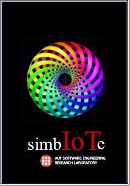

## simbIoTe 

simbIoTe is a general-purpose, open-source simulation environment. It can be used to create both responsive physical environments as well as Human-Machine-Interfaces (HMIs) to support developers while their IoT hardware and software is under development.

# Initial release (1st April, 2020)

The first version of simbIoTe implemented a Heating, Ventilation and Air-Conditioning (HVAC) environment simulator. This supported co-simulation for an IEC 61499 Function Block HVAC controller that was being developed as part of my PhD research. 

HVACsim implements a realistic simulation of a building. Using its own TCP/IP server, it responds to requests from the IEC 61499 client devices. HVACsim can be polled for the temperature at specific locations in the building. Temperatures are calculated from heating and cooling actions applied to the room by the function block application.
