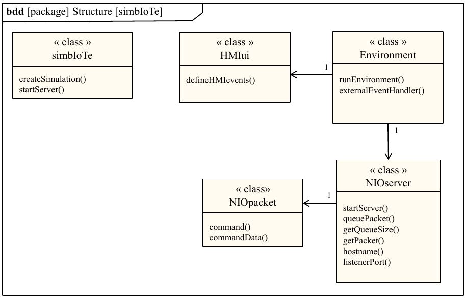

# simbIoTe 

*simbIoTe* is a general-purpose, open-source simulation environment. It can be used to create both responsive physical environments as well as Human-Machine Interfaces (HMIs) to support developers while their IoT hardware and software is under development.

## Implementation of the Integrated Development Environment Summer 2022-2023

The IDE branch implements the Integrated Development Environment (IDE) for simbIoTe. This allows users to create new simulations and modify existing ones. Each simulation is managed using a project definition file that allows the simulation resources, including objects, graphics and view definitions to be tracked and used by the IDE. 

A rough layout of the core components is shown below:

