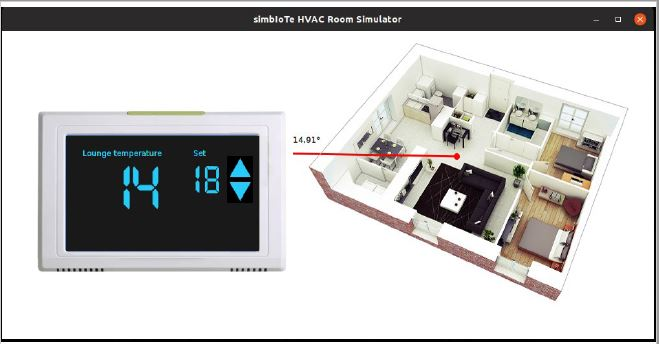
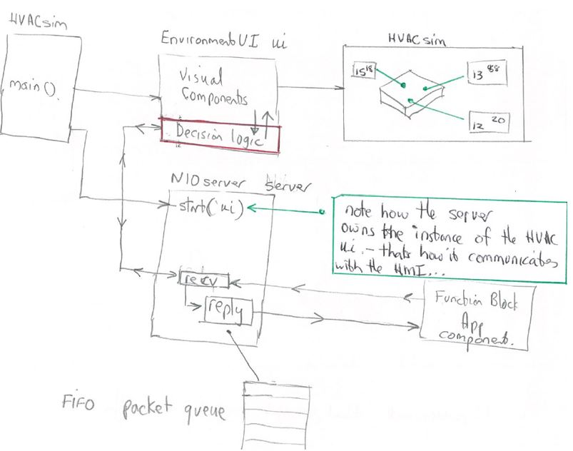

# simbIoTe 

*simbIoTe* is a general-purpose, open-source simulation environment. It can be used to create both responsive physical environments as well as Human-Machine Interfaces (HMIs) to support developers while their IoT hardware and software is under development.

## Initial release (1st April, 2020)

The first exploratory version of *simbIoTe* was use to build a Heating, Ventilation and Air-Conditioning (HVAC) environment simulator. This supported co-simulation for an IEC 61499 Function Block HVAC controller that was being developed as part of my PhD research. 

HVACsim implements a realistic simulation of a building. Using its own TCP/IP server, it responds to requests from the IEC 61499 client devices. HVACsim can be polled for the temperature at specific locations in the building. Temperatures are calculated from heating and cooling actions applied to the room by the function block application. The Room Panel also provides clickable buttons to change the desired room temperature which communicate with the IEC 61499 application.

## Current development (22nd June 2021)

HVACsim uses in-line Swing components to create the main simulation window and all visual components. That helped to refine the core capabilities. However, to make the product more versatile it needs an in-built graphics layout tool. The current work includes an evaluation of products like the open-source Window Builder as a way to create a seamless IDE tool. This would make the HMI layout easier to create and maintain while retaining the ability to quickly customise the other parts of the simulation directly in Java. 

A rough layout of the core components is shown below:

